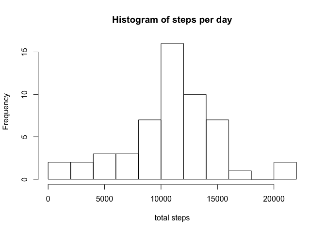
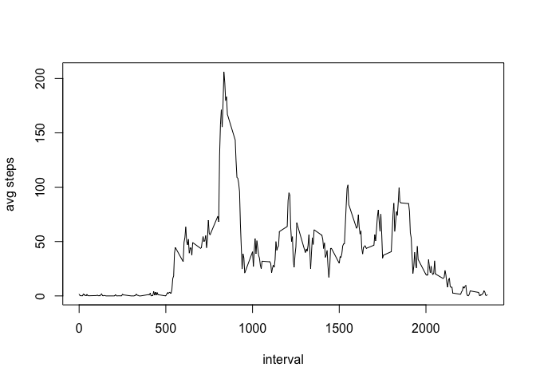

## Loading the packages we'll use

For this assignment I'll use the `dplyr` and `ggplot2` packages:


```r
library(dplyr)
library(ggplot2)
```

## Loading and preprocessing the data

First, I'll load the data and convert the "date" column from a factor class to a Date class:


```r
all_data <- read.csv("activity.csv")
all_data$date <- as.Date(as.character(all_data$date), format="%Y-%m-%d")
summary(all_data)
```

```
##      steps             date               interval     
##  Min.   :  0.00   Min.   :2012-10-01   Min.   :   0.0  
##  1st Qu.:  0.00   1st Qu.:2012-10-16   1st Qu.: 588.8  
##  Median :  0.00   Median :2012-10-31   Median :1177.5  
##  Mean   : 37.38   Mean   :2012-10-31   Mean   :1177.5  
##  3rd Qu.: 12.00   3rd Qu.:2012-11-15   3rd Qu.:1766.2  
##  Max.   :806.00   Max.   :2012-11-30   Max.   :2355.0  
##  NA's   :2304
```

## What is mean total number of steps taken per day?

I calculated the mean number of steps per day using `dplyr`:


```r
steps_per_day <- all_data %>%
  filter(!is.na(steps)) %>%
  group_by(date) %>%
  summarize(total_steps=sum(steps))
```

Now I'll plot a histogram of the number of steps per day:


```r
hist(steps_per_day$total_steps,
     breaks=15,
     main="Histogram of steps per day",
     xlab="total steps")
```

<!-- -->

Now I'll calculate the mean and the median number of steps per day:


```r
mean_steps <- mean(steps_per_day$total_steps)
median_steps <- median(steps_per_day$total_steps)
```

The mean number of steps per day is 10766.

The median number of steps per day is 10765.

## What is the average daily activity pattern?

To look at the average daily activity pattern, first I'll group the `all_data` dataframe by the "interval" column, and take the average number of steps on each interval:


```r
steps_per_interval <- all_data %>%
  filter(!is.na(steps)) %>%
  group_by(interval) %>%
  summarize(avg_steps=mean(steps))
```

Now I'll plot the average number of steps for each interval:


```r
plot(steps_per_interval$interval, steps_per_interval$avg_steps, type="l", xlab="interval", ylab="avg steps")
```

<!-- -->

Now I'll figure out which interval has the largest value for average steps:

```r
most_active_interval <- steps_per_interval[steps_per_interval$avg_steps==max(steps_per_interval$avg_steps),
                                           "interval"]
```

The interval with the largest number of steps, averaged over all the days of the study, is Interval 835.

## Imputing missing values

First I'll calculate the fraction of values in the "steps" column that are NA:


```r
frac_missing <- mean(is.na(all_data$steps))
```

It looks like about 13.11% of values in the "steps" column are NA. I verified that there are no NA values in the "date" or "interval" columns.

## Are there differences in activity patterns between weekdays and weekends?
