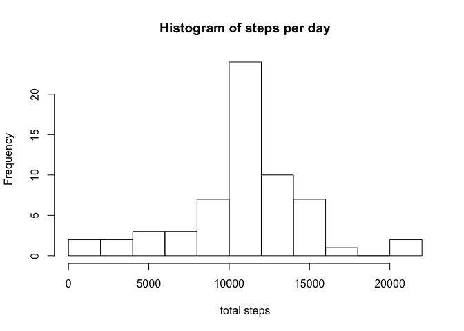
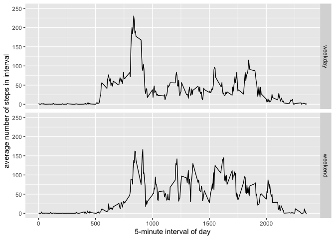

## Loading the packages we'll use

For this assignment I'll use the `dplyr` and `ggplot2` packages:


```r
library(dplyr)
library(ggplot2)
```

## Loading and preprocessing the data

First, I'll load the data and convert the "date" column from a factor class to a Date class:


```r
all_data <- read.csv("activity.csv")
all_data$date <- as.Date(as.character(all_data$date), format="%Y-%m-%d")
summary(all_data)
```

```
##      steps             date               interval     
##  Min.   :  0.00   Min.   :2012-10-01   Min.   :   0.0  
##  1st Qu.:  0.00   1st Qu.:2012-10-16   1st Qu.: 588.8  
##  Median :  0.00   Median :2012-10-31   Median :1177.5  
##  Mean   : 37.38   Mean   :2012-10-31   Mean   :1177.5  
##  3rd Qu.: 12.00   3rd Qu.:2012-11-15   3rd Qu.:1766.2  
##  Max.   :806.00   Max.   :2012-11-30   Max.   :2355.0  
##  NA's   :2304
```

## What is mean total number of steps taken per day?

I calculated the mean number of steps per day using `dplyr`:


```r
steps_per_day <- all_data %>%
  filter(!is.na(steps)) %>%
  group_by(date) %>%
  summarize(total_steps=sum(steps))
```

Now I'll plot a histogram of the number of steps per day:


```r
hist(steps_per_day$total_steps,
     breaks=15,
     main="Histogram of steps per day",
     xlab="total steps")
```

<!-- -->

Now I'll calculate the mean and the median number of steps per day:


```r
mean_steps <- mean(steps_per_day$total_steps)
median_steps <- median(steps_per_day$total_steps)
```

The mean number of steps per day is 10766.

The median number of steps per day is 10765.

## What is the average daily activity pattern?

To look at the average daily activity pattern, first I'll group the `all_data` dataframe by the "interval" column, and take the average number of steps on each interval:


```r
steps_per_interval <- all_data %>%
  filter(!is.na(steps)) %>%
  group_by(interval) %>%
  summarize(avg_steps=mean(steps))
```

Now I'll plot the average number of steps for each interval:


```r
plot(steps_per_interval$interval, steps_per_interval$avg_steps, type="l", xlab="interval", ylab="avg steps")
```

<!-- -->

Now I'll figure out which interval has the largest value for average steps:

```r
most_active_interval <- steps_per_interval[steps_per_interval$avg_steps==max(steps_per_interval$avg_steps),
                                           "interval"]
```

The interval with the largest number of steps, averaged over all the days of the study, is Interval 835.

## Imputing missing values

First I'll calculate the fraction of values in the "steps" column that are NA:


```r
frac_missing <- mean(is.na(all_data$steps))
```

It looks like about 13.11% of values in the "steps" column are NA. I verified that there are no NA values in the "date" or "interval" columns.

Here I replace all NA values with the average number of steps for that interval, and save the new dataframe as `filled_in_NAs`:


```r
impute.mean <- function(x) replace(x, is.na(x), mean(x, na.rm = TRUE))
filled_in_NAs <- all_data %>% group_by(interval) %>% mutate(steps = impute.mean(steps))
```

For the dataset with the imputed values, I calculated the mean number of steps per day in the same way as above:


```r
steps_per_day_imputed <- filled_in_NAs %>%
  group_by(date) %>%
  summarize(total_steps=sum(steps))
```

Here's a histogram of the number of steps per day for the imputed dataset:


```r
hist(steps_per_day_imputed$total_steps,
     breaks=15,
     main="Histogram of steps per day",
     xlab="total steps")
```

<!-- -->

Now I'll calculate the mean and the median number of steps per day:


```r
mean_steps_imputed <- mean(steps_per_day_imputed$total_steps)
median_steps_imputed <- median(steps_per_day_imputed$total_steps)
```

The mean number of steps per day is 10766, and the median number of steps per day is exactly equal to the mean, at 10766.

Imputing the missing values did not change the mean number of steps per day, but it did increase the median very slightly so that it is now equal to the mean. This makes sense because of the technique that was used to impute the missing values. If a value was missing, it was assigned to the mean value for that time interval. Therefore, many values for "steps" toward the middle of the distribution are the mean itself. In this case, one of those mean values happened to be the median value as well.

## Are there differences in activity patterns between weekdays and weekends?

To look at differences between weekday and weekend patterns, first I'll make a new column in `filled_in_NAs` containing a factor variable for whether that date is a weekday or weekend:


```r
filled_in_NAs <- filled_in_NAs %>%
  mutate(day_type = as.factor(ifelse(weekdays(date) == "Saturday" | weekdays(date) == "Sunday",
                                     "weekend","weekday")))
```

Next I'll make a new dataframe, `weekday_weekend_avgs`, containing the average number of steps for each day type-interval combination:


```r
weekday_weekend_avgs <- filled_in_NAs %>% group_by(day_type, interval) %>% summarize(avg_steps=mean(steps))
```

Finally, I'll use `ggplot2` to make a panel plot to examine the differences between weekday and weekend patterns:


```r
g <- ggplot(weekday_weekend_avgs, aes(x=interval, y=avg_steps))
g +
  geom_line() +
  ylim(c(0,250)) +
  labs(x="5-minute interval of day", y="average number of steps in interval") +
  facet_grid(rows=vars(day_type))
```

<!-- -->

The plots indicate, perhaps as expected, that people are on a later schedule on the weekends, with less of a spike in number of steps in the morning and a broader distribution in number of steps throughout the day. Overall, people are more active on the weekend, taking on average 42.4 steps per 5-minute interval on the weekend, compared to 35.6 steps per 5-minute interval during the week.
